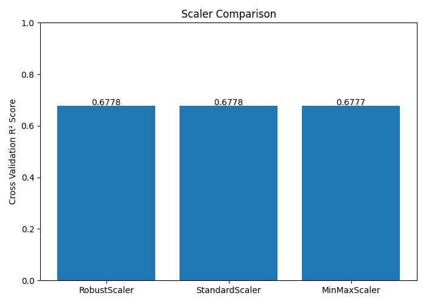
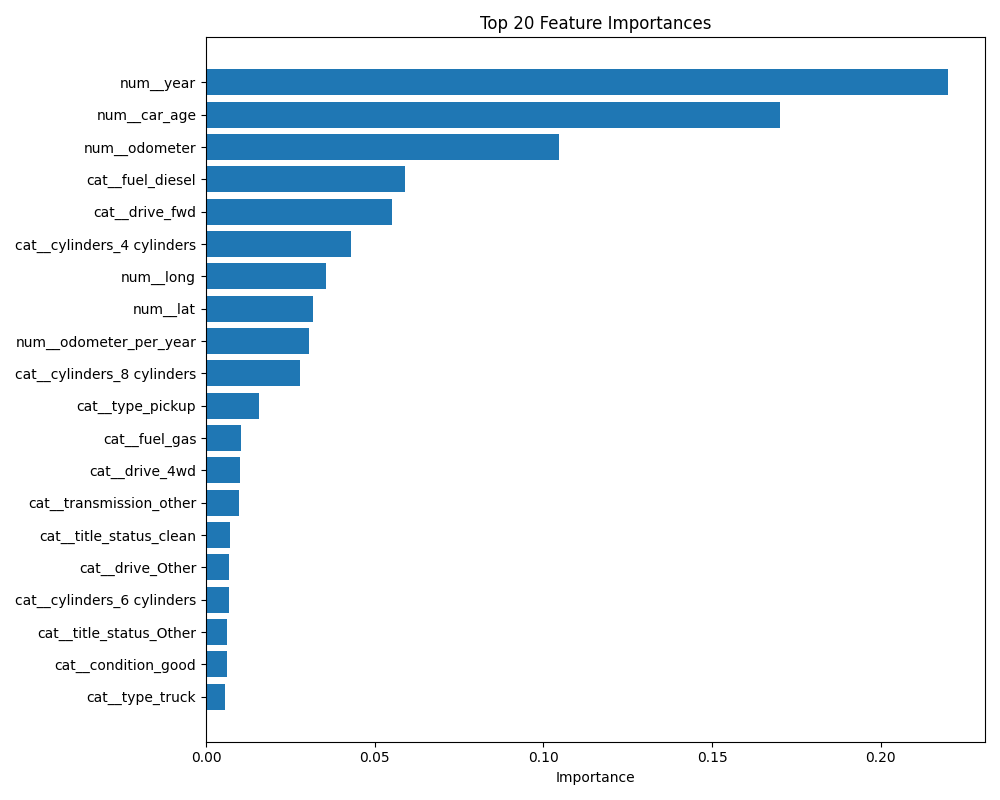
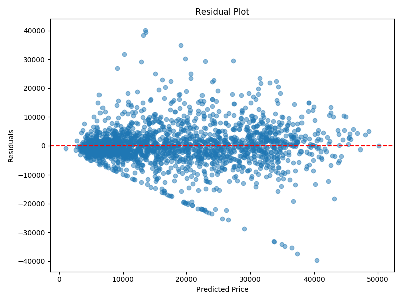

# Used Car Price Prediction Project

## Project Objective

This project predicts fair market prices for used cars using machine learning techniques.

The goal is not only to achieve high prediction accuracy, but also to analyze important factors affecting used-car prices and identify potentially overpriced or underpriced listings.

---

## Dataset

- Dataset: Craigslist Vehicles Dataset
- Source: Kaggle
- Records: 426,880
- Features: 26

---

## Main Techniques

- Data Cleaning
- Missing Value Handling
- Feature Engineering
- Feature Scaling Comparison
- One-Hot Encoding
- Random Forest Regression
- Hyperparameter Tuning
- Cross Validation
- Price Gap Analysis
- Visualization

---

## Feature Engineering

Additional features:

- car_age
- odometer_per_year
- is_high_mileage

---

## Evaluation Metrics

- MAE
- RMSE
- R² Score
- MAPE

---

## Visualizations

### Scaler Comparison



### Feature Importance



### Residual Plot



---

## How to Run

```bash
python src/used_car_prediction.py
```

---

## Requirements

Install dependencies:

```bash
pip install -r requirements.txt
```

---

## Team Members

- 정문석
- 이재서
- 임준서
